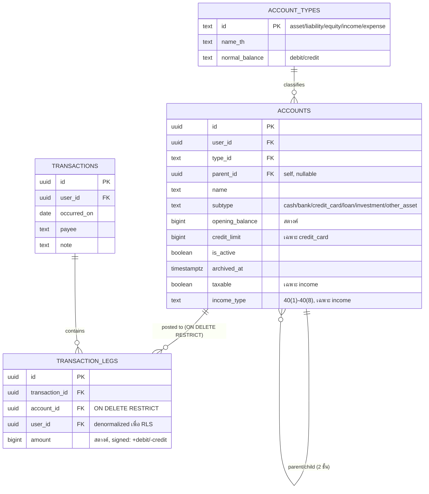

# SPEC — Foundation (C1)

> Frozen: 22 ก.ค. 2569 (schema) — อ้างอิง `REQUIREMENTS.md` §2, §3

## ขอบเขต
Schema แกน double-entry + repo scaffold ที่ทุกฟีเจอร์ถัดไป (C2–C7) พึ่งพา ไม่รวม UI ฟีเจอร์ใดๆ และไม่รวม PWA scaffold (เลื่อนไป C2)

## ER

## Invariant → กลไกบังคับ (ตาม REQUIREMENTS §3.3)

| Invariant | กลไก |
|---|---|
| ผลรวม leg ต่อ transaction = 0 | `CONSTRAINT TRIGGER` แบบ `DEFERRABLE INITIALLY DEFERRED` บน `transaction_legs`, เช็คตอน commit |
| ห้ามลบ account ที่มี leg | FK `transaction_legs.account_id ... ON DELETE RESTRICT` — archive ผ่าน `archived_at` แทน |
| ยอดคงเหลือ/งบดุล/net worth = view สด | `v_account_balances`, `v_balance_sheet`, `v_net_worth` ไม่มี materialized/cache table |
| RLS ต่อผู้ใช้ | `auth.uid() = user_id` ทุกตาราง user data; `account_types` select-only สำหรับ authenticated |

## Convention สำคัญที่ฟีเจอร์ถัดไปต้องรู้
- `transaction_legs.amount` เป็น bigint หน่วยสตางค์ **signed**: บวก = เดบิต, ลบ = เครดิต ต้อง map ตาม REQUIREMENTS §3.4 ตอนสร้าง UI เงินเข้า/เงินออก/โอน (C3)
- `accounts` ลึกสุด 2 ชั้น (หมวด/หมวดย่อย) — บังคับด้วย trigger `enforce_account_hierarchy_depth`
- `accounts.subtype` เป็น enum ปิดตายตัว 6 ค่า: `cash`, `bank`, `credit_card`, `loan`, `investment`, `other_asset`
- `accounts.taxable` + `income_type` ตั้งได้เฉพาะ `type_id = 'income'` (เชื่อม Thai PIT engine ใน C6)
- ไม่บังคับขั้นต่ำ 2 legs ต่อ transaction (เช็คแค่ sum=0) — transaction ที่เหลือ 0 legs ถือเป็น edge case ที่ยอมรับได้

## Repo scaffold
- Vite + React + TypeScript (`react-ts` template)
- `src/lib/supabase.ts` — Supabase client จาก `VITE_SUPABASE_URL` / `VITE_SUPABASE_ANON_KEY`
- `src/features/{auth,accounts,transactions,reports,analysis,budget,tax}/` — โฟลเดอร์เปล่า scaffold ให้ C2 เป็นต้นไป
- `src/types/database.ts` — generate ผ่าน `supabase gen types typescript`
- `supabase/migrations/` — migration files ตาม schema ข้างต้น

## Non-goals ของ C1
- UI ฟีเจอร์ใดๆ (auth/COA/transactions — อยู่ C2 เป็นต้นไป)
- PWA scaffold (เลื่อนไป C2)
